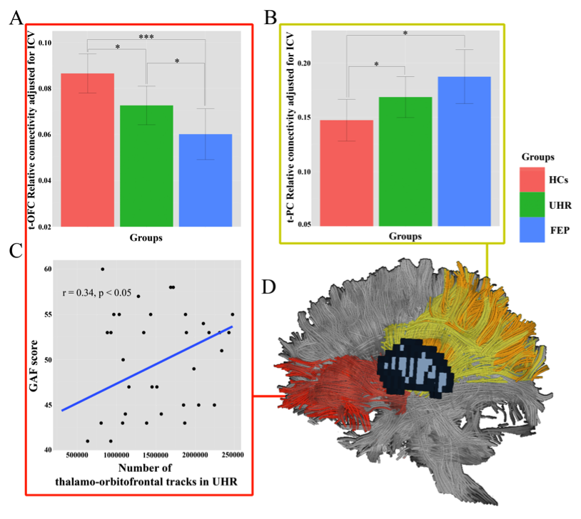

#Result summary

## Thalamus volume : ANOVA

* No change

## Intracranial volume : ANOVA

* No change

## Relative connectivity

* Left and Right together

###With covariate

* intracranial volume as the covariate 

cortex|ANOVA p-value
---|---
OFC|0.000702
PC|0.035097

###Post-hoc analysis : glm

cortex|group|p-value
---|---|---
OFC|CHR vs FEP|0.0321
OFC|FEP vs CON|0.00070
OFC|CON vs CHR|0.02454
PC|CHR vs FEP|0.315
PC|FEP vs CON|0.0151
PC|CON vs CHR|0.0422

##Total connectivity

* Left and Right together

###With covariate

* intracranial volume as the covariate 

cortex|ANOVA p-value
---|---
OFC|0.002749
OCC|0.015850
SMC|0.035469

##Correlation

###OFC total connectivity vs GAF in CHR

* p-value : 0.0359
* correlation coefficient : 0.341

## Python script
<iframe width="800" height="700" src="http://nbviewer.ipython.org/github/kcho/kcho.github.io/blob/master/thalamusCHRFEP/Summary.ipynb" frameborder="0" allowfullscreen></iframe>

